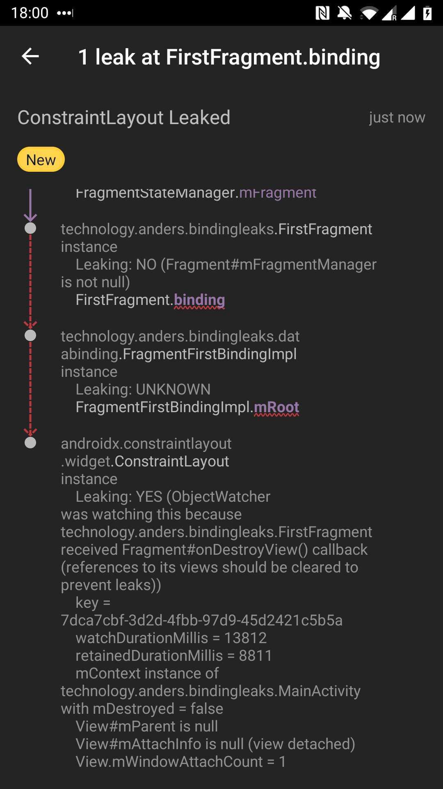

> 이 글은 Medium의 [Anders Ullnæss](https://proandroiddev.com/@Zredna)가 작성한 [Avoiding memory leaks when using Data Binding and View Binding](https://proandroiddev.com/avoiding-memory-leaks-when-using-data-binding-and-view-binding-3b91d571c150)을 번역한 것입니다.

> This article is a translation of [Avoiding memory leaves when using Data Binding and View Binding](https://proandroiddev.com/avoiding-memory-leaks-when-using-data-binding-and-view-binding-3b91d571c150) by [Anders Ullnnss](https://proandroiddev.com/@Zredna) of Medium.


우리는 현재 진행하고 있는 프로젝트에서 많은 Data Binding을 사용하고 있고, 최근에는 View Binding 역시 사용하기 시작했습니다.

전에, 우리는 [LeakCanary](https://square.github.io/leakcanary)로 메모리 누수를 찾는 방법을 보여주는 [Pierre-Yves Ricau](https://twitter.com/Piwai)와 [Emily Kager](https://twitter.com/EmilyKager)의 [영상](https://www.youtube.com/watch?v=kHHOhPPRytc)에 영감을 받았고, 우리의 프로젝트에 추가했습니다. 우리는 곧 사방에 떨어지는 새들을 보았습니다. (많은 메모리 누수를 발견하였습니다.)


이 새는 데이터 바인딩 메모리 누수를 처리할 수 없었습니다.

## 메모리 누수는 모든 곳에

Data Binding을 사용할 때 우리는 다음과 같이 Binding을 Fragmentdp lateinit var로 추가하곤 했습니다.

```kt
private lateinit var binding: FragmentFirstBinding

override fun onCreateView(
    inflater: LayoutInflater,
    container: ViewGroup?,
    savedInstanceState: Bundle?
): View? {
    binding = FragmentFirstBinding.inflate(inflater, container, false)
    return binding.root
}
```
[Github Gist by Anders Ullnæss (FirstFragment.kt)](https://gist.github.com/andersu/99e66199d7ce162415b3daf2fc729901#file-firstfragment-kt)

이것은 메모리 누수를 발생시킵니다.

|메모리 누수 발견|세부 정보|
|------------|-------|
|||

LeakCanary는 우리의 `binding`이 Fragment에 있는 `onDestroyView()`가 호출된 이후 View에 대한 Reference(`mRoot`)를 계속 참조하고 있으며 이로 인해 메모리 누수가 발생할 수 있다고 말하고 있습니다.
View Binding에 관한 [구글 공식 문서](https://developer.android.com/topic/libraries/view-binding#fragments)에서는 실제로 메모리 누출을 피하기 위한 적절한 방법을 알려주고 있습니다.

```kt
private var _binding: ResultProfileBinding? = null
// This property is only valid between onCreateView and
// onDestroyView.
private val binding get() = _binding!!

override fun onCreateView(
    inflater: LayoutInflater,
    container: ViewGroup?,
    savedInstanceState: Bundle?
): View? {
    _binding = ResultProfileBinding.inflate(inflater, container, false)
    val view = binding.root
    return view
}

override fun onDestroyView() {
    super.onDestroyView()
    _binding = null
}
```
[Github Gist by Anders Ullnæss (GoogleFragment.kt)](https://gist.github.com/andersu/203f69f2abdb29b6ad7f3447ac2ba31b#file-googlefragment-kt)

이것은 Optional 보조 Field, 그리고 `onCreateView()`와 `onDestroyView()`사이에서만 유효한 val을 사용하는 방법입니다. `onCreateView`에서 Optional 보조 Field가 지정되고, `onDestroyView()`에서 지워집니다. 이것은 메모리 누수가 없습니다!

이 방법은 앞서 제가 언급했던 [영상](https://youtu.be/kHHOhPPRytc?t=1269)에서도 다룹니다.

당신은 `!!`을 사용하는 데에 있어 약간의 불편함을 느낄 수도 있지만, 우리가 말하고자 하는 것은 해당 Field를 사용할 때에 null이 아니라는 것입니다. (`onCreateView()`와 `onDestroyView()`시이에서의 생명주기) 이것은 우리가 `lateinit var`를 사용했을 때 의도한 바와 같습니다.

## 멋지네, 근데 이제 모든 Fragment에 여러 줄을 추가해야 하나요?

우리 앱은 Fragment가 많아서 어디에나 이 변경점을 적용하면 지루할 것입니다. 얼마 전 [Kirill Rozov가 블로그에 올린 글](https://proandroiddev.com/make-android-view-binding-great-with-kotlin-b71dd9c87719)에서 그가 만든 작은 view binding 위임 라이브러리에 대해 이야기했는데, 그것은 여러분에게 꽤 번거로움을 덜어줍니다. 자세한 내용은 그의 블로그 게시물에서 확인하실 수 있습니다. 하지만 이를 통해 다음과 같이 바인딩을 작성할 수 있습니다:

```kt
private val binding: FragmentFirstBinding by viewBinding()
```
[Github Gist by Anders Ullnæss (FirstFragment.kt)](https://gist.github.com/andersu/e2d1d725a66f0b27195e8cc859669cce#file-firstfragment-kt)

그의 view binding 프로퍼티 위임은 라이프사이클의 적절한 시기에 바인딩의 설정과 삭제를 처리하므로, 우리의 귀찮음을 덜어줍니다.
그의 예에서 배운 또 다른 요령으로, 우리는 실제로 `onCreateView()` 메소드 전체를 없앨 수 있습니다. Fragment는 `onCreateView()`에서 layout에 대한 참조를 가지며 적절한 시점에 inflate하는 생성자를 가지고 있는 것으로 밝혀졌습니다. (이것이 원래 존재했습니까?!):

```kt
class FirstFragment : Fragment(R.layout.fragment_first) {

  private val binding: FragmentFirstBinding by viewBinding()

  override fun onViewCreated(view: View, savedInstanceState: Bundle?) {
      super.onViewCreated(view, savedInstanceState)
      // Any code we used to do in onCreateView can go here instead
  }
}
```
[Github Gist by Anders Ullnæss (FirstFragment.kt)](https://gist.github.com/andersu/8d5baef0403145a7476ceaee287672d6#file-firstfragment-kt)

## view binding 뿐만 아니라, data binding에도 적용할 수 있을까요?

어쩌면 이것이 상식일지도 모르지만, 나는 데이터 바인딩이 뷰 바인딩이라는 것을 알게 된 순간:

```kt
public abstract class ViewDataBinding extends BaseObservable implements ViewBinding
```
[Github Gist by Anders Ullnæss (ViewDataBinding.java)](https://gist.github.com/andersu/01c9319eea685a397d0a9b6b3c054504#file-viewdatabinding-java)

이것은 우리가 view binding이나 data binding중 무엇을 사용하든 상관없이 이 게시물에서 했던 모든 것이 적용될 수 있다는 것을 의미합니다!
이것이 도움이 되었는지, 또는 질문이 있거나, 어떤 실수나 개선 사항이 있는지 저에게 알려주십시요.

[ViewBindingPropertyDelegate](https://github.com/kirich1409/ViewBindingPropertyDelegate)
