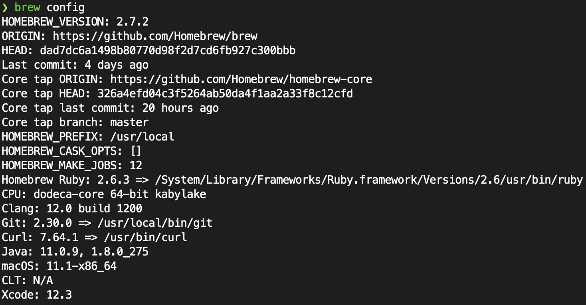
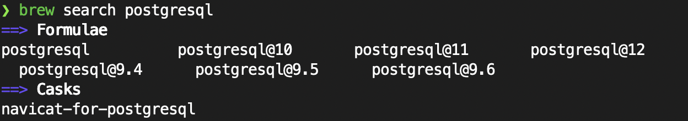
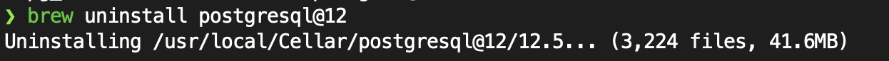

# Homebrew란?

> [https://brew.sh/](https://brew.sh/)

패키지 관리자(package manager, 패키지 매니저), 패키지 관리 시스템(package management system)은 컴퓨터의 운영 체제를 위해 일정한 방식으로 컴퓨터 프로그램의 설치, 업그레이드, 구성, 제거 과정을 자동화하는 소프트웨어 도구들의 모임입니다. ([위키백과](https://ko.wikipedia.org/wiki/%ED%8C%A8%ED%82%A4%EC%A7%80_%EA%B4%80%EB%A6%AC%EC%9E%90)) Homebrew는 macOS를 위한 패키지 관리자입니다. Linux에서도 사용할 수 있습니다. Windows에는 [chocolatey](https://chocolatey.org/)라는 패키지 관리자가 있습니다.

Homebrew는 CUI 방식이기 때문에 ```터미널.app```에서 명령어를 입력하고 출력된 결과를 확인하는 방식으로 사용합니다.

# 설치

```터미널.app```을 열고 다음을 입력하면 됩니다. Xcode가 설치되어 있지 않다면, Homebrew는 git 시스템을 이용하기 때문에 Xcode Command Line Tools 설치가 필요할 수 있습니다.

```bash
/bin/bash -c "$(curl -fsSL https://raw.githubusercontent.com/Homebrew/install/HEAD/install.sh)"
```

완료가 되면 ```brew config``` 를 입력하여 설치가 잘 완료되었는지 확인할 수 있습니다.



# 패키지 검색

search 명령어를 통해 패키지를 검색할 수 있습니다. 

```bash
brew search 검색어
```

예를 들어 데이터베이스 프로그램 중 하나인 postgresql을 검색해 보겠습니다.



Homebrew에서는 패키지의 고유한 이름 또는 ID를 Formulae라고 합니다. 버전별로 요구가 많은 유명한 프로그램들은 위와 같이 ```프로그램@버전```과 같이 패키지 이름이 지정되 있어서 메이저 버전을 선택하여 설치할 수 있습니다.

# 패키지 설치

install 명령어를 통해 패키지를 설치합니다.

```bash
brew install `Formulae`
```

위에서 검색한 패키지 중 제일 최신 버전을 설치해 보겠습니다. 결과는 아래와 같이 여러 단계로 이루어집니다.

## 업데이트

기존에 설치되어 있는 패키지들의 버전을 자동으로 업데이트합니다.

```sh
Updating Homebrew...
==> Auto-updated Homebrew!
Updated 3 taps (homebrew/cask-versions, homebrew/core and homebrew/cask).
==> New Formulae
lp_solve                                tctl
==> Updated Formulae
Updated 69 formulae.
==> New Casks
raycast
==> Updated Casks
Updated 64 casks.
==> Deleted Casks
jeromelebel-mongohub
```

## 패키지 다운로드

설치하려는 패키지가 요구하는 패키지들을 포함하여 파일들을 다운로드합니다.

```sh
==> Downloading https://homebrew.bintray.com/bottles/krb5-1.18.3.big_sur.bottle.1.tar.gz
==> Downloading from https://d29vzk4ow07wi7.cloudfront.net/a72fae06ddd1d796a6c1ab55a9c8bc15e8e051c67e72412dbc86cea9bcd04c62?response-content-dis
######################################################################## 100.0%
==> Downloading https://homebrew.bintray.com/bottles/postgresql%4012-12.5.big_sur.bottle.tar.gz
==> Downloading from https://d29vzk4ow07wi7.cloudfront.net/6e1717130028267c3f8c3910e10909fde608892da4af2669842da0dca386392a?response-content-dis
######################################################################## 100.0%
```

## 패키지 설치

패키지를 하나하나씩 설치합니다. 설치하려는 패키지가 가장 마지막에 설치됩니다. 설치 후 패키지가 차지하는 용량을 보여줍니다.

```sh
==> Installing dependencies for postgresql@12: krb5
==> Installing postgresql@12 dependency: krb5
...
==> Summary
🍺  /usr/local/Cellar/krb5/1.18.3: 162 files, 5.2MB
==> Installing postgresql@12
...
==> Summary
🍺  /usr/local/Cellar/postgresql@12/12.5: 3,224 files, 41.6MB
```

## 주의사항

마지막으로 설치된 패키지들의 주의사항을 알려줍니다. 패키지의 symlink 여부, 초기화 내역, 환경변수 설정 등을 알려줍니다. 예를 들어, 아래 krb5는 맥에 이미 다른 버전의 krb가 설치되어 있기 때문에 /usr/local에 symlink를 생성하지 않았다고 경고하고 있습니다. 이는 ```터미널.app```에서 krb5를 실행하면 Homebrew로 설치한 버전이 아닌 맥에 기본으로 깔린 버전이 실행됨을 의미합니다. 또한, postgresql과 같은 경우에는 데이터베이스가 UTF-8 인코딩으로 초기화되었다고 알려주고 있습니다.

```sh
==> Caveats
==> krb5
krb5 is keg-only, which means it was not symlinked into /usr/local,
because macOS already provides this software and installing another version in
parallel can cause all kinds of trouble.
...
==> postgresql@12
This formula has created a default database cluster with:
  initdb --locale=C -E UTF-8 /usr/local/var/postgresql@12
...
```

# 제거

uninstall 명령어를 통해 패키지를 제거합니다.

```bash
brew uninstall `Formulae`
```

위에서 설치한 패키지를 제거해 보겠습니다.



여기서 주의해야 할 것은 postgresql@12 하나만 제거된다는 것입니다. 의존성 패키지까지 모두 제거하기 위해서는 아래의 명령어를 사용해야 합니다.

# 의존성 패키지 제거

autoremove 명령어를 통해 더이상 의존성이 없는 패키지를 자동으로 제거할 수 있습니다.


드디어 krb5가 제거된 모습을 확인할 수 있습니다.

# 업데이트

소프트웨어의 버전을 계속 업데이트됩니다. Homebrew에서는 upgrade 명령어를 통해 최신 버전 정보를 업데이트하고 모든 패키지를 업그레이드할 수 있습니다. update 명령어를 통해 버전 정보만을 업데이트할 수 있지만 사용할 일은 거의 없습니다.

```sh
❯ brew upgrade
==> Upgrading 2 outdated packages:
imagemagick 7.0.10-56 -> 7.0.10-57
python@3.9 3.9.1_5 -> 3.9.1_6
```

# 더보기

본 글에서는 Homebrew의 기본적인 명령어들을 통해 주로 개발에 사용되는 프로그램들을 관리하는 방법을 알아보았습니다. 

Homebrew를 통해 macOS앱들의 설치, 업데이트, 제거를 관리하기 위해서는 Homebrew Cask를 이용하면 됩니다.

